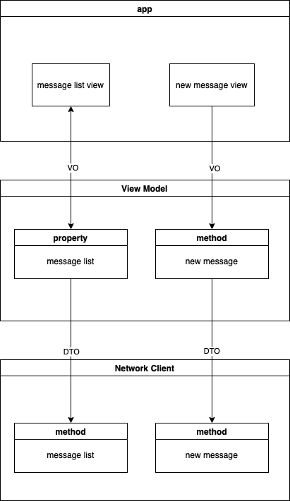

# ChatApp
A simple chat app. 

## Implementation
It is developed using `SwiftUI`, `Combine` and `asynchronous swift API` without extra dependencies.
Minimum iOS version is 15 due to use of asynchronous API.

## Design
The app uses simplified MVVM pattern.

* **DataModel:** defines `DTO` and fully generated from a `json schema`.
* **Network:** implementation if a network client. It performs basic network operations: retrieving list of messages and creating a new message.
* **ViewModel:** defines a view model, which provides necessary functionality for retrieving and sending messages using `NetworkClient`. It also contains data transformation logic (converts DTO into VO and vise versa).
* **App:** provides app UI and uses `ViewModel` for interacting with network. `App` listens to `ViewModel` changes and updates UI using `Combine`.

## Tests
`DataModel`, `ViewModel` are covered with unit tests and use `json` samples as input data.

Nice to have, but not implemented:

* UI tests for testing basic app workflow (register, get messages, send a message). Should use a mock server.
* Network tests using a mock server.
* Snapshot tests to ensure UI consistency.

All these tests can be ran on a CI server, so testing will be fully automated.
Manual testing is still desirable cause creation and maintenance of UI tests is tough and doesn't guarantee that app doesn't have bugs. Also QA helps with problem reproduction.

## Tradeoffs
Use of cutting edge technologies greatly simplifies app development, but also limits user audience. It might be critical for services whose customers use old devices (seniors, children, low income people).
Minimum SwiftUI iOS version is 13, but we require 15 cause of async api. By using less convenient but fully functional `URLSession` we can lower OS requirements.
Current implementation uses a single `ViewModel` which will lead to oversized code. When app becomes more complex, it should be split into smaller and more specialized view models (e.g. message list model, message composition model, registration model, etc.). It will also reduce number of VOs.